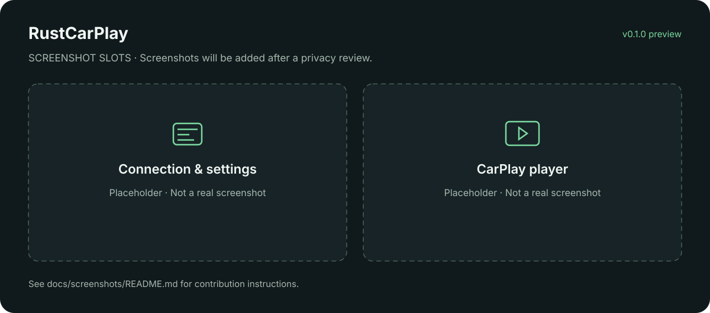

# RustCarPlay

[中文](README.md) · **English**

A Rust CarPlay receiver based on [DiPlay](https://github.com/shihabal3amri/DiPlay). Shared Rust code implements the protocols and sessions, native adapters connect to each operating system, **egui / wgpu** provides the desktop UI, and **GStreamer** handles media.

**v0.1.1 provides desktop installer previews: Windows Setup, macOS DMG and Ubuntu DEB.** Media runtimes and fixed experimental authentication material are included; portable archives remain available. Windows development builds have been tested with one iPhone over wireless and USB; CI and installation validation are still in progress. Full DiPlay feature parity and long-running stability remain unfinished.

[Releases](https://github.com/Ezreal-byte/RustCarPlay/releases) · [Development guide](docs/DEVELOPMENT.md) · [Acceptance record](docs/ACCEPTANCE.md) · [Issues](https://github.com/Ezreal-byte/RustCarPlay/issues)

## Screenshots



*This is a labeled placeholder, not a device screenshot. See the [screenshot contribution guide](docs/screenshots/README.md).*

## Platform status

| Platform | v0.1.1 scope and status |
| --- | --- |
| Windows 11 x64 | One iPhone tested: wireless/USB video, touch and audio; USB pause and reconnect also passed an initial user test |
| Linux x64 / ARM64 | Ubuntu 24.04 / glibc 2.39 baseline; USB, BlueZ and NetworkManager backends implemented, with no physical-device acceptance yet |
| macOS Intel / Apple Silicon | macOS 15 GUI/core preview, not notarized; native RFCOMM, USB and network configuration adapters are unfinished, so receiver connections are unavailable |
| Android | Not built in this release; Kotlin/JNI shell and platform adapters not implemented |
| HarmonyOS / NEXT | Not built in this release; ArkTS/native bridge, permissions and device capabilities remain unverified |

A build target does not prove a successful release or working device connection. Check Releases and workflow results for available artifacts. Twenty connection cycles, a two-hour session, Siri/calls, audio device switching and sleep recovery remain unverified.

## What is implemented

- **Three connection configurations:** LAN, computer hotspot and USB. LAN uses the current system Wi-Fi profile without an in-app password field. Actual hotspot operation and phone connection still need testing.
- **Shared protocols:** iAP2, USBMUX/NCM, Lockdown/CarKit integration, accessory authentication, AirPlay pairing, encrypted control/media, discovery and session cleanup.
- **Media and input:** H.264/HEVC software decoding, AAC/Opus/LPCM playback, touch input and track/navigation metadata. Microphone return has implementation and synthetic tests, but lacks device acceptance.
- **Desktop UI:** connection/settings home, automatic player navigation on the first decoded frame, custom title bar, fullscreen, day/night controls and local diagnostics. The current UI is primarily Chinese.

`carplay-protocol`, `carplay-auth`, `carplay-wireless` and `carplay-receiver` implement protocols; `carplay-platform` owns system adapters, `carplay-media` handles playback, and `carplay-app` shares session lifecycle. See the [architecture](docs/ARCHITECTURE.md). Hardware decoding, complete second-screen support, P2P, AEC, parked video and vehicle extensions are not delivered.

## Getting started

Download the installer matching your OS and architecture from [Releases](https://github.com/Ezreal-byte/RustCarPlay/releases), then verify `SHA256SUMS`:

| System | Download and installation |
| --- | --- |
| Windows 11 x64 | Run `RustCarPlay-0.1.1-windows-x86_64-setup.exe`, then open RustCarPlay from Start; application installation is per-user and needs no administrator privileges |
| macOS 15 | Choose `RustCarPlay-0.1.1-macos-aarch64.dmg` (Apple Silicon) or `RustCarPlay-0.1.1-macos-x86_64.dmg` (Intel), then drag the app to Applications; GUI/core preview only, with no CarPlay connection support |
| Ubuntu 24.04 | Run `sudo apt install ./rustcarplay_0.1.1_amd64.deb`; use `rustcarplay_0.1.1_arm64.deb` on ARM64, then launch from the application menu; device connections remain unverified |

Ordinary launch needs no separately installed development tools or GStreamer, and no manual certificate path. Installed applications keep personal settings, pairings and logs in user data directories; uninstalling preserves that data. See the [exact locations](docs/DEVELOPMENT.md#installation-and-personal-data). For portable use, extract the whole ZIP/TAR into a writable directory and run its root `RustCarPlay.exe` or `./RustCarPlay`.

Start with LAN on Windows: join the same Wi-Fi on the computer and iPhone, pair Bluetooth in system settings, then connect without an in-app Wi-Fi password. USB additionally needs Apple Mobile Device Service, trust/permissions and [device configuration](docs/WINDOWS_USB_DRIVER.md); its preparation scripts require PowerShell 7 and SDK signature tools and are not run by the installer. Linux connections require system BlueZ, NetworkManager, usbmuxd and suitable permissions.

The bundled experimental identity comes from the fixed **DiPlay v0.2.15 preview APK**, attributed upstream to **public Carlinkit firmware**. It is not newly issued and is not covered by the source-code GPL license. Public download availability does not establish redistribution permission; distribution suitability and continued acceptance by future iOS releases remain unresolved. The archive includes `resources/auth/provenance.json`; private keys are excluded from Git and source archives. See [third-party notices](docs/THIRD_PARTY_NOTICES.md).

Use `RustCarPlay --cli` for the command line (`RustCarPlay.exe --cli` on Windows). Package layout, source builds, troubleshooting and recovery are documented in the [development guide](docs/DEVELOPMENT.md). See the [v0.1.1 notes](docs/releases/v0.1.1.md) for release changes.

## Development

```sh
git clone https://github.com/Ezreal-byte/RustCarPlay.git
cd RustCarPlay
cargo test --workspace --locked
```

Install Rust stable, the platform toolchain and desktop system libraries. Media-enabled builds also need GStreamer development files. Default tests are not native-media or physical-device acceptance. Start with the [architecture](docs/ARCHITECTURE.md), [remaining acceptance work](docs/ACCEPTANCE.md), or the bilingual [Android / HarmonyOS porting plan](docs/MOBILE_PORTING.md).

## Attribution and license

The fixed reference is DiPlay commit [`9e244d958afe6b8fd79ade49769ce25a944f397b`](https://github.com/shihabal3amri/DiPlay/tree/9e244d958afe6b8fd79ade49769ce25a944f397b), whose receiver originates from [xcertplay](https://github.com/shilapi/xcertplay). This project ports protocol behavior to Rust and retains source attribution; it does not wrap an Android APK for desktop use.

Project code is [GPL-3.0-only](LICENSE). Bundled runtimes, upstream assets and dependencies retain their own licenses. Matching Rust and native dependency source attachments accompany the release; see [third-party notices](docs/THIRD_PARTY_NOTICES.md). The CarPlay name and original icon belong to Apple and are outside the project's GPL source license. This project does not imply Apple certification or endorsement.
