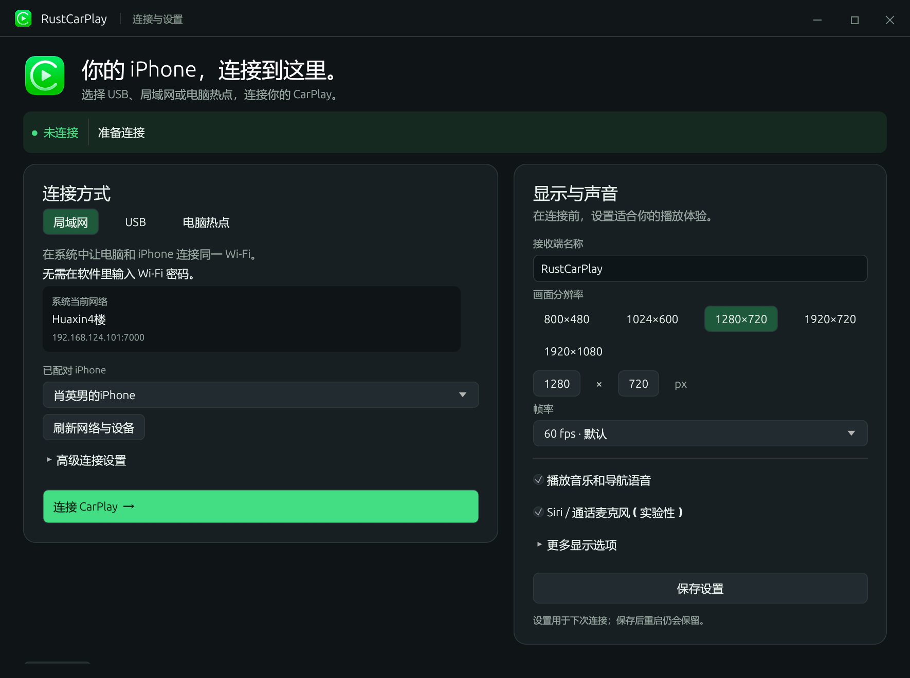
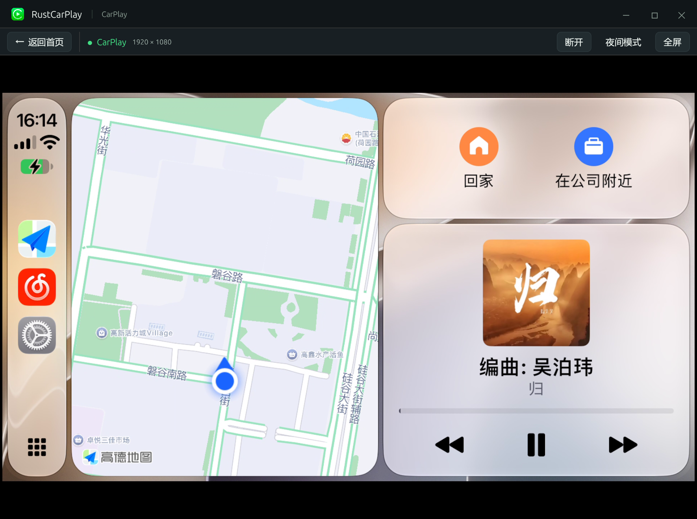

# RustCarPlay

**中文** · [English](README.en.md)

基于 [DiPlay](https://github.com/shihabal3amri/DiPlay) 的 Rust CarPlay 接收端。以共享 Rust 协议实现连接与媒体会话，通过平台原生适配器接入设备，桌面界面使用 **egui / wgpu**，媒体后端使用 **GStreamer**。

**当前源码版本为 v0.1.4；桌面产物包括 Windows Setup、macOS DMG 和 Ubuntu DEB 预览。** 已发布版本以 Releases 为准，提交代码或 CI 通过不代表创建了新 Release。媒体运行时和固定的实验认证材料随包提供，另保留便携包。已有 Windows 开发版本与一台 iPhone 的无线/USB 实测；尚未完成 DiPlay 功能对齐和长期稳定性验收。

[下载 / Releases](https://github.com/Ezreal-byte/RustCarPlay/releases) · [开发与运行](docs/DEVELOPMENT.md) · [验收记录](docs/ACCEPTANCE.md) · [问题反馈](https://github.com/Ezreal-byte/RustCarPlay/issues)

## 界面预览



连接与设置：首页提供局域网、USB、电脑热点配置，以及分辨率预设和默认 60 fps。



2026-10-09 用户提供的 Windows 实际运行截图。画面页显示 1920×1080；截图不能单独证明实际帧率、声音、连接模式或其他平台支持。[截图说明](docs/screenshots/README.md)。

## 平台状态

| 平台 | 当前实现范围与状态 |
| --- | --- |
| Windows 11 x64 | 一台 iPhone 实测：无线/USB 画面、触控和声音；USB 暂停与重连初测正常 |
| Linux x64 / ARM64 | Ubuntu 24.04 / glibc 2.39 基线；USB、BlueZ 与 NetworkManager 后端已有实现，尚未真机验收 |
| macOS Intel / Apple Silicon | macOS 15 GUI/核心预览，未公证；原生 RFCOMM、USB 及网络配置适配尚未完成，不能完成接收端连接 |
| Android | 本轮不构建；Kotlin/JNI 外壳及系统适配未实现 |
| HarmonyOS / NEXT | 本轮不构建；ArkTS/原生桥接、权限和真机能力尚未验证 |

构建目标不代表该平台已有成功发布或真机支持，实际产物以 Releases 和工作流结果为准。20 次连接循环、两小时运行、Siri/通话、音频设备切换和休眠恢复仍待验收。

## 已实现什么

- **三种连接配置：**局域网、电脑热点、USB。局域网使用系统当前 Wi-Fi 配置，无需在应用输入密码；热点实际启停与手机连接仍待验证。
- **共享协议：**iAP2、USBMUX/NCM、Lockdown/CarKit 集成、配件认证、AirPlay 配对/加密控制与媒体、发现与会话清理。
- **媒体与输入：**H.264/HEVC 软件解码，AAC/Opus/LPCM 输出，触控回传和曲目/导航元数据。麦克风回传已有代码及合成测试，真机功能待验收。
- **桌面体验：**连接/设置首页、首帧自动切入画面页、自定义顶栏、全屏、日夜切换和本地诊断。当前界面主要为中文。

协议集中在 `carplay-protocol`、`carplay-auth`、`carplay-wireless`、`carplay-receiver`；`carplay-platform` 负责系统边界，`carplay-media` 负责媒体，`carplay-app` 共享会话生命周期。详见[架构](docs/ARCHITECTURE.md)。硬解、完整第二屏、P2P、AEC、停车视频及车辆扩展尚未交付。

## 开始使用

从 [Releases](https://github.com/Ezreal-byte/RustCarPlay/releases) 下载匹配系统与架构的安装包，并核对 `SHA256SUMS`：

| 系统 | 下载与安装 |
| --- | --- |
| Windows 11 x64 | 运行 `RustCarPlay-0.1.1-windows-x86_64-setup.exe`，安装后从开始菜单打开；应用按当前用户安装，无需管理员权限 |
| macOS 15 | 选择 `RustCarPlay-0.1.1-macos-aarch64.dmg`（Apple Silicon）或 `RustCarPlay-0.1.1-macos-x86_64.dmg`（Intel），将应用拖入 Applications；目前仅供界面/核心预览，不能连接 CarPlay |
| Ubuntu 24.04 | 使用 `sudo apt install ./rustcarplay_0.1.1_amd64.deb`；ARM64 将文件名换为 `rustcarplay_0.1.1_arm64.deb`，安装后从应用菜单打开；真机连接仍待验证 |

普通启动无需另装开发工具或 GStreamer，也无需手填认证目录。安装版将个人设置、配对和日志保存到用户数据目录，卸载保留这些数据；[具体路径](docs/DEVELOPMENT.md#安装与个人数据)。需要便携使用时，完整解压 ZIP/TAR 到可写目录，启动根目录的 `RustCarPlay.exe` 或 `./RustCarPlay`。

Windows 建议先选局域网模式：电脑与 iPhone 加入同一 Wi-Fi，在系统中完成蓝牙配对后连接，应用内无需输入 Wi-Fi 密码。USB 另需 Apple Mobile Device Service、信任/权限与[设备配置](docs/WINDOWS_USB_DRIVER.md)。v0.1.4 的“准备 Windows USB”入口显示执行阶段并保存拔插续接进度，支持 PowerShell 5.1／7；驱动准备需管理员权限，系统可能自动批准而不显示弹窗。标准包自带驱动签名校验工具，复用部分旧驱动仍需 SDK 校验。Linux 连接需要系统 BlueZ、NetworkManager、usbmuxd 和相应权限。

离线包的实验身份取自固定 **DiPlay v0.2.15 预览 APK**，上游声明来源为 **Carlinkit 公开固件**。它不是新签发身份，不适用项目源码的 GPL 许可；公开可下载不等于获得再分发许可，分发适用性与未来 iOS 接受情况仍未确定。来源记录随包放在 `resources/auth/provenance.json`，私钥不进入 Git 或源码包。详见[第三方声明](docs/THIRD_PARTY_NOTICES.md)。

安装版命令行：Linux 使用 `rustcarplay --cli`；Windows 在安装目录中用 PowerShell 运行 `.\RustCarPlay.exe --cli`；macOS 使用 `/Applications/RustCarPlay.app/Contents/MacOS/RustCarPlay --cli`。便携版从解压目录运行根启动器并添加 `--cli`。包结构、源码构建、故障定位和恢复命令见[开发文档](docs/DEVELOPMENT.md)，本轮变化见 [v0.1.1 说明](docs/releases/v0.1.1.md)。

## 从源码开发

```sh
git clone https://github.com/Ezreal-byte/RustCarPlay.git
cd RustCarPlay
cargo test --workspace --locked
```

需要 Rust stable、对应平台编译工具和桌面系统库；启用媒体功能还需 GStreamer 开发文件。默认测试不等于 native 媒体或真机验收。开发者可从[架构](docs/ARCHITECTURE.md)、[验收缺口](docs/ACCEPTANCE.md)和 [Android / HarmonyOS 延续方案](docs/MOBILE_PORTING.md)选取工作项。

## 来源与许可证

固定参考为 DiPlay 提交 [`9e244d958afe6b8fd79ade49769ce25a944f397b`](https://github.com/shihabal3amri/DiPlay/tree/9e244d958afe6b8fd79ade49769ce25a944f397b)，其接收端源自 [xcertplay](https://github.com/shilapi/xcertplay)。本项目在 Rust 中移植协议与行为，保留源文件来源声明；不是对 Android APK 的桌面封装。

项目代码使用 [GPL-3.0-only](LICENSE)。随包运行时、上游素材及各依赖保留自己的许可证；同一 Release 提供 Rust 与原生依赖对应源码附件，详见[第三方声明](docs/THIRD_PARTY_NOTICES.md)。CarPlay 名称与原始图标属于 Apple，不适用本项目代码的 GPL 许可；本项目不表示 Apple 认证或授权。
